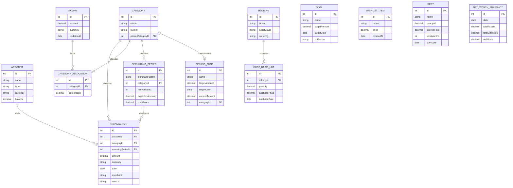

# Personal finance app — complete implementation blueprint

A privacy-first, on-device iPhone finance app. Personal use only (Xcode / TestFlight, not published). Security is the non-negotiable priority; every other decision bends around it. This document is meant to be read once and followed phase by phase — each phase states exactly what to build, how to build it, and precisely what the next phase inherits from it.

---

## 0. How to use this document

Work through Section 7 in order. Each phase has:
- **Objective** — what this phase delivers.
- **Tasks** — the specific, concrete steps.
- **Code** — real Swift (or Python, where noted) showing the implementation approach, not just a description.
- **Watch out for** — the integration traps specific to that phase.
- **Feeds into next phase** — the exact artifact/interface the next phase depends on.

Don't skip ahead. Every later phase assumes the previous phase's interfaces exist and are tested.

---

## 1. Core principles

- **On-device only.** No cloud backend, no bank-credential linking, no third-party data sharing.
- **Encrypted at rest, gated by biometrics.** Losing the phone should not mean losing the data.
- **Manual/AI-assisted capture instead of bank sync** — Apple Pay automation, OCR, voice, manual entry, statement screenshots.
- **Narrow, explicit exceptions to "no network"** — only for read-only public data (stock/FX prices), never for anything that identifies you or your holdings.
- **External advice stays external.** Stock buy/sell/hold signals are generated by a separate scheduled Claude Cowork task and imported as reviewed data, never generated live inside the app.

---

## 2. Visual design direction

Based on the reference screens you shared, the app should read as **alive and layered**, not flat corporate. The specific characteristics to carry through every screen:

- **Dark mode is the hero mode**, not an afterthought — a deep green-to-black gradient background (not pure black) is the signature look. Light mode mirrors the same structure with light surfaces, but dark is the primary design target.
- **Glassmorphism** — cards sit as semi-transparent, frosted-glass surfaces layered over the gradient background, not opaque white/black rectangles. This is what gives the "alive" feeling in the references.
- **Mint/lime green as the single primary accent** — used for primary CTAs (Transfer, Send), positive values, and the active tab indicator. Don't dilute this by introducing a second bright accent.
- **A warm cream/yellow as the one secondary accent** — used specifically for contrast in dual-series bar charts (income vs. expense) and multi-segment progress bars. Keep it rare and intentional, exactly like the reference screens use it.
- **Multi-segment progress bars**, not single-color ones — the wishlist cards in your reference use three visually distinct segments (paid so far / this period's contribution / remaining) rather than one bar filling left to right. Reuse this pattern for goal progress and allocation bars.
- **A radial gauge/arc dial** for the single "big number" moment (net worth on the home screen) as an alternative to a plain numeral — this is the "All Total" dial in your Business Account reference.
- **Circular icon/avatar chips** for categories and any people/contacts references.
- **Rounded corners generously** — 16–28px, not the tight 8px corners of a typical enterprise app.

### Implementation approach (SwiftUI)

```swift
// MARK: - Design tokens
// Centralizing these in one file means every screen pulls from the same
// palette, and switching a color later touches one place, not forty.
enum AppTheme {
    // Named semantically, not by hue, so "AccentMint" still makes sense
    // if the exact shade changes later.
    static let accentMint = Color("AccentMint")       // Defined in Assets.xcassets with light/dark variants
    static let accentCream = Color("AccentCream")
    static let backgroundGradientStart = Color("BackgroundGradientStart")
    static let backgroundGradientEnd = Color("BackgroundGradientEnd")

    static var backgroundGradient: LinearGradient {
        LinearGradient(
            colors: [backgroundGradientStart, backgroundGradientEnd],
            startPoint: .top,
            endPoint: .bottom
        )
    }
}

// MARK: - Reusable glass card
// Every card on every screen should use this one view, not a hand-rolled
// background per screen — that's how visual drift creeps in over time.
struct GlassCard<Content: View>: View {
    let content: Content
    init(@ViewBuilder content: () -> Content) { self.content = content() }

    var body: some View {
        content
            .padding(18)
            .background(.ultraThinMaterial) // The frosted-glass effect, built into SwiftUI
            .cornerRadius(24)
            .overlay(
                RoundedRectangle(cornerRadius: 24)
                    .stroke(Color.white.opacity(0.08), lineWidth: 0.5)
            )
    }
}

// MARK: - Radial gauge for net worth
// A simple arc built from Shape + trim(from:to:) — no third-party charting
// library needed for something this specific.
struct RadialGauge: View {
    let progress: Double // 0...1, e.g. how "healthy" net worth trend is this month

    var body: some View {
        ZStack {
            Circle()
                .trim(from: 0.1, to: 0.9)
                .stroke(Color.white.opacity(0.15), style: StrokeStyle(lineWidth: 14, lineCap: .round))
                .rotationEffect(.degrees(90))
            Circle()
                .trim(from: 0.1, to: 0.1 + progress * 0.8)
                .stroke(AppTheme.accentMint, style: StrokeStyle(lineWidth: 14, lineCap: .round))
                .rotationEffect(.degrees(90))
                .animation(.easeInOut(duration: 0.6), value: progress)
        }
    }
}
```

Use Apple's **Swift Charts** framework (`import Charts`) for the dual-tone weekly bar chart (income vs. expense) — it supports exactly this pattern with `BarMark` and a `foregroundStyle(by:)` modifier mapping series to your two accent colors, without hand-drawing bars.

**Watch out for:** glassmorphism only reads correctly over a busy/gradient background — if you reuse `GlassCard` on a plain white screen it'll look like a bug (barely visible border), not a design choice. Always pair it with `AppTheme.backgroundGradient` as the screen's base layer.

---

## 3. Feature list (MoSCoW)

### Must have — v1 / MVP

- Encrypted local persistence (SQLCipher + GRDB), `Decimal` for all money fields
- Face ID / Touch ID app lock — locks immediately on backgrounding
- Separate, deliberate logout action that clears in-memory decrypted key material
- Manual transaction entry
- Receipt OCR (Vision framework, Arabic + English)
- Apple Pay capture via Shortcuts' native Transaction/Wallet automation trigger + custom App Intent
- Account & category management
- Net worth dashboard
- Salary-based percentage allocation budgeting (must total exactly 100%, single current salary, no history)
- Category-based / flexible budgeting mode (fixed / non-monthly recurring / flexible buckets)
- Transaction search
- Swipe-based quick review/edit
- Monthly review summary
- Light and dark theme (dark as the primary design target — see Section 2)
- Data export (CSV/JSON)
- Encrypted local backup/export

### Should have — soon after MVP

- Recurring-transaction detection via periodicity clustering
- Bills/subscriptions calendar or list view with notifications
- Anomaly/duplicate transaction detection
- Monthly savings tracker (income − total spent)
- What-if goal planner with proactive cut suggestions, cut scope chosen per-goal
- Wishlist with time-to-save shown both ways (months at savings rate, days of life-energy)
- Debt payoff / amortization tracking
- Sinking funds
- Customizable charts/reports including a Sankey diagram
- Drag-and-drop dashboard widgets
- Arabic voice input

### Could have — valuable, can wait

- On-device LLM assistant
- Forecasting / Monte Carlo net worth and retirement projection
- Investment/holdings tracking with cost-basis lots and gains/losses
- Self-built asset-class breakdown (approximation of "Fund Analysis")
- Household/local-network sync (deferred)
- Multi-currency support beyond EGP/USD if needed

### Won't have — this round

- SOC2 Type 2 certification
- Shared credit score monitoring
- Real Morningstar integration
- Live in-app stock buy/sell/hold recommendations (external Cowork task instead)
- Unlimited real-time collaborators / live household sharing

---

## 4. Tech stack & architecture

| Layer | Choice | Why |
|---|---|---|
| UI | Swift + SwiftUI, MVVM | Native, full access to Face ID, Keychain, Vision, Speech, notifications |
| Modularity | Local Swift Package Manager modules (Persistence, Categorization, Forecasting, LLM, UI) | Testable, avoids one monolithic target |
| Persistence | GRDB.swift + SQLCipher | Full-database encryption regardless of device-lock state |
| Money type | `Decimal`, never `Double` | Avoids binary floating-point rounding errors |
| On-device LLM | MLX Swift, 1-1.5B quantized model | Fits iPhone 14 Pro's 6 GB RAM with thermal headroom |
| OCR | Vision framework (`VNRecognizeTextRequest`, `["ar","en"]`, `.accurate`) | On-device, mixed Arabic/English receipts |
| Voice | `SFSpeechRecognizer` first, WhisperKit fallback | Test both against real Egyptian-Arabic phrasing |
| Apple Pay capture | Shortcuts "Transaction"/"Wallet" trigger to custom App Intent | Apple's documented, App-Store-safe mechanism |
| Charts | Swift Charts (`import Charts`) | Native, supports the dual-tone bar pattern directly |
| Security | Keychain + Secure Enclave, `LAContext`, CryptoKit (AES-GCM) | Key material never extractable without Face ID |
| ML training pipeline | Python (pandas, scikit-learn) on your laptop, exported to Core ML via `coremltools` | Keeps prototyping in Python; inference stays on-device in Swift |
| Distribution | Personal use only, Xcode / TestFlight | Apple Developer Program ($99/yr) recommended for 1-year signing |

### Suggested project folder structure

```
FinanceApp/
  App/                       App entry point, scene delegate, theme setup
  Packages/
    Persistence/              GRDB models, migrations, DatabaseManager
    Security/                 Keychain wrapper, LAContext gate, backup/export
    Capture/                  Manual entry, OCR, voice, App Intent
    Budgeting/                 SalaryAllocationService, category logic
    SavingsAndGoals/           Goal planner, wishlist, debt, sinking funds
    Forecasting/               Monte Carlo engine
    LLM/                       MLX wrapper, prompt templates
    UI/                        SwiftUI screens, GlassCard, RadialGauge, theme tokens
  Tests/
```

**Coding conventions to apply throughout:**
- Favor simple, explainable logic over clever one-liners.
- Comment generously, especially on why, not just what.
- State time complexity in comments wherever a loop, query, or aggregation could scale with data size.
- Prefer one clear SQL aggregate over looping and summing by hand.
- Note the source methodology inline as a comment wherever a feature rests on specific research (recurring-detection heuristics, Monte Carlo modeling, the 50/30/20 rule, etc.).

---

## 5. Data model (ERD)



`GOAL` and `WISHLIST_ITEM` are deliberately unlinked, evaluated against live aggregates computed at query time, not tied by foreign key. `DEBT` is standalone; can optionally reference an `ACCOUNT` later.

---

## 6. Security model

**Session and lock behavior**
- App locks immediately when backgrounded, no grace period.
- Foreground re-entry requires Face ID / Touch ID, device passcode as fallback.
- Logout is a distinct, stronger action from a simple re-lock: it invalidates in-memory decrypted key material and forces re-derivation from the Secure Enclave.

**Threat-model lens (STRIDE, Kohnfelder and Garg, Microsoft, 1999)**
- Spoofing: biometric gate plus Secure Enclave-backed keys.
- Tampering: SQLCipher encryption, minimal write surfaces.
- Repudiation: not a major concern for a single-user app; skip heavy audit logging.
- Information disclosure: no network entitlements beyond an explicit price/FX allowlist.
- Denial of service: not applicable, no shared service to overload.
- Elevation of privilege: session-timeout plus distinct logout design.

Full concrete implementation is in Phase 1 below, this section is the policy, Phase 1 is the code.

---

## 7. Phased implementation guide

### Phase 0, environment setup

**Objective:** an empty, correctly configured project you can build on without revisiting tooling decisions later.

**Tasks:**
1. Create a new Xcode project, SwiftUI App template, minimum deployment target iOS 17 (needed for the latest Charts APIs and MLX Swift compatibility).
2. Set up your Apple Developer Program membership (paid, $99/yr) so signing certificates last a year instead of the free tier's 7-day resign cycle.
3. Add Swift Package Manager dependencies:
   - `GRDB.swift` (with the SQLCipher-enabled build target)
   - `mlx-swift` and `mlx-swift-examples` (Apple's on-device LLM framework)
   - Optionally `WhisperKit` (only add this in Phase 2 if `SFSpeechRecognizer` proves insufficient for Arabic, do not pull it in prematurely)
4. Create the folder/package structure from Section 4.
5. Set up a local (not cloud-synced) git repository for version history, this protects your work without violating the "no cloud" principle since git history stays on your machine/laptop.
6. Add SwiftLint as a build phase for consistent formatting, catches style drift early.
7. Create the `Assets.xcassets` color set entries referenced in Section 2 (`AccentMint`, `AccentCream`, `BackgroundGradientStart`, `BackgroundGradientEnd`) with explicit light and dark appearance variants.

**Watch out for:** don't add MLX Swift and WhisperKit both on day one "just in case", each adds real build time and app size. Add them exactly when the phase that needs them arrives (Phase 5 for MLX, Phase 2 only if needed for Whisper).

**Feeds into Phase 1:** a buildable, empty app shell with the dependency graph and folder structure already in place, so Phase 1 is pure logic, not tooling.

---

### Phase 1, persistence and security foundation

**Objective:** an encrypted, biometric-gated database that every later phase reads and writes through. This is the phase everything else depends on, nothing in Phases 2-6 should touch SQLite directly, it always goes through what you build here.

**Tasks:**

**1.1, key generation and storage**

```swift
import Security
import LocalAuthentication

// MARK: - KeychainKeyManager
// Owns the single 256-bit database encryption key. The key never exists
// in plain memory longer than one function call, and is never written to
// disk anywhere except inside the Secure Enclave-backed Keychain entry.
final class KeychainKeyManager {
    private let keyTag = "com.yourapp.dbEncryptionKey"

    /// Generates a new 256-bit key on first launch only. Time complexity
    /// is irrelevant here, this runs exactly once in the app's lifetime.
    func generateAndStoreKeyIfNeeded() throws {
        if (try? retrieveKey()) != nil { return } // Already exists, nothing to do.

        var keyBytes = [UInt8](repeating: 0, count: 32) // 256 bits
        let status = SecRandomCopyBytes(kSecRandomDefault, keyBytes.count, &keyBytes)
        guard status == errSecSuccess else {
            throw KeyManagerError.randomGenerationFailed
        }
        let keyData = Data(keyBytes)

        // kSecAccessControlBiometryCurrentSet: the key becomes UNUSABLE if
        // the enrolled Face ID/Touch ID changes (e.g. a new fingerprint is
        // added), this is a deliberate security tripwire, not a bug.
        var accessError: Unmanaged<CFError>?
        guard let access = SecAccessControlCreateWithFlags(
            nil,
            kSecAttrAccessibleWhenPasscodeSetThisDeviceOnly,
            .biometryCurrentSet,
            &accessError
        ) else {
            throw KeyManagerError.accessControlCreationFailed
        }

        let query: [String: Any] = [
            kSecClass as String: kSecClassGenericPassword,
            kSecAttrAccount as String: keyTag,
            kSecValueData as String: keyData,
            kSecAttrAccessControl as String: access
        ]

        let addStatus = SecItemAdd(query as CFDictionary, nil)
        guard addStatus == errSecSuccess else {
            throw KeyManagerError.keychainWriteFailed
        }
    }

    /// Retrieves the key. This call itself triggers the Face ID prompt
    /// via the access control policy attached at creation time, you do
    /// not need to call LAContext separately for the Keychain read itself,
    /// though you DO still need a separate LAContext check to gate the
    /// rest of the UI (see 1.3).
    func retrieveKey() throws -> Data {
        let query: [String: Any] = [
            kSecClass as String: kSecClassGenericPassword,
            kSecAttrAccount as String: keyTag,
            kSecReturnData as String: true
        ]
        var result: AnyObject?
        let status = SecItemCopyMatching(query as CFDictionary, &result)
        guard status == errSecSuccess, let data = result as? Data else {
            throw KeyManagerError.keyNotFound
        }
        return data
    }
}

enum KeyManagerError: Error {
    case randomGenerationFailed
    case accessControlCreationFailed
    case keychainWriteFailed
    case keyNotFound
}
```

**1.2, encrypted database manager**

```swift
import GRDB

// MARK: - DatabaseManager
// Single source of truth for the encrypted connection. Every service in
// every later phase (Budgeting, SavingsAndGoals, Capture, etc.) reads
// through this, never opens SQLite directly.
final class DatabaseManager {
    static let shared = DatabaseManager()
    private var _dbQueue: DatabaseQueue?
    private let keyManager = KeychainKeyManager()

    /// Throws if the app is locked, this is the enforcement point.
    /// Every service function should start with try DatabaseManager.shared.dbQueue()
    /// rather than caching a reference, so a stale unlocked connection can
    /// never survive past a logout.
    func dbQueue() throws -> DatabaseQueue {
        if let queue = _dbQueue { return queue }
        return try openConnection()
    }

    private func openConnection() throws -> DatabaseQueue {
        let keyData = try keyManager.retrieveKey() // Triggers Face ID via access control.
        var config = Configuration()
        config.prepareDatabase { db in
            // GRDB's SQLCipher integration: the passphrase IS the raw key
            // bytes, hex-encoded, not a human password, much stronger
            // than a typed passphrase would be.
            let hexKey = keyData.map { String(format: "%02x", $0) }.joined()
            try db.usePassphrase(hexKey)
        }
        let dbPath = try databasePath()
        let queue = try DatabaseQueue(path: dbPath, configuration: config)
        try runMigrations(on: queue)
        _dbQueue = queue
        return queue
    }

    private func databasePath() throws -> String {
        let dir = FileManager.default.urls(for: .applicationSupportDirectory, in: .userDomainMask)[0]
        return dir.appendingPathComponent("finance.sqlite").path
    }

    /// Called by the logout action (1.4). This is what makes logout
    /// meaningfully stronger than a simple screen re-lock, the actual
    /// decrypted connection is torn down, not just hidden behind a UI lock.
    func invalidateSession() {
        _dbQueue = nil
    }

    private func runMigrations(on queue: DatabaseQueue) throws {
        var migrator = DatabaseMigrator()

        migrator.registerMigration("v1_initial_schema") { db in
            try db.create(table: "account") { t in
                t.autoIncrementedPrimaryKey("id")
                t.column("name", .text).notNull()
                t.column("type", .text).notNull()
                t.column("currency", .text).notNull()
                t.column("balance", .text).notNull() // Stored as text, decoded as Decimal, SQLite has no native Decimal type.
            }
            try db.create(table: "category") { t in
                t.autoIncrementedPrimaryKey("id")
                t.column("name", .text).notNull()
                t.column("bucket", .text).notNull()
                t.column("parentCategoryId", .integer).references("category")
            }
            try db.create(table: "transaction") { t in
                t.autoIncrementedPrimaryKey("id")
                t.column("accountId", .integer).notNull().references("account")
                t.column("categoryId", .integer).notNull().references("category")
                t.column("recurringSeriesId", .integer).references("recurringSeries")
                t.column("amount", .text).notNull()
                t.column("currency", .text).notNull()
                t.column("date", .datetime).notNull()
                t.column("merchant", .text)
                t.column("source", .text).notNull()
            }
            // Index on (categoryId, date): every monthly-summary aggregate
            // and every recurring-detection query filters on exactly this
            // pair, so this single index is what keeps those queries O(log n)
            // instead of a full table scan as history grows across years.
            try db.create(index: "idx_transaction_category_date", on: "transaction", columns: ["categoryId", "date"])

            // Remaining tables (categoryAllocation, income, recurringSeries,
            // goal, wishlistItem, debt, sinkingFund, holding, costBasisLot,
            // netWorthSnapshot) follow the identical pattern: one
            // db.create(table:) block matching the ERD field list in
            // Section 5, one column per field, decimal fields as .text.
        }

        try migrator.migrate(queue)
    }
}
```

**1.3, app lock gating (SwiftUI scene phase)**

```swift
import SwiftUI
import LocalAuthentication

// MARK: - AppLockViewModel
// Drives the unlock screen. Watches scenePhase and locks INSTANTLY on
// .background, no grace period, per the security requirement.
@MainActor
final class AppLockViewModel: ObservableObject {
    @Published var isUnlocked = false

    func lock() {
        isUnlocked = false
        DatabaseManager.shared.invalidateSession() // Tear down the decrypted connection, not just the UI.
    }

    func attemptUnlock() async {
        let context = LAContext()
        var error: NSError?
        guard context.canEvaluatePolicy(.deviceOwnerAuthentication, error: &error) else {
            isUnlocked = false
            return
        }
        do {
            let success = try await context.evaluatePolicy(
                .deviceOwnerAuthentication, // Face ID/Touch ID, falls back to device passcode automatically.
                localizedReason: "Unlock your finances"
            )
            isUnlocked = success
        } catch {
            isUnlocked = false
        }
    }
}

// In your root App/Scene:
struct FinanceApp: App {
    @StateObject private var lockViewModel = AppLockViewModel()
    @Environment(\.scenePhase) private var scenePhase

    var body: some Scene {
        WindowGroup {
            ContentView()
                .environmentObject(lockViewModel)
                .onChange(of: scenePhase) { _, newPhase in
                    if newPhase == .background {
                        lockViewModel.lock() // Immediate, no Task/delay/timer.
                    }
                }
                .task {
                    if !lockViewModel.isUnlocked {
                        await lockViewModel.attemptUnlock()
                    }
                }
        }
    }
}
```

**1.4, logout (distinct from lock)**

```swift
// MARK: - LogoutAction
// The top-right button from your UI direction. Deliberately more than a
// re-lock: it also removes the Keychain-stored key material entirely,
// so unlocking again requires the FULL key-generation flow to run once
// more. Use this distinction consistently, a re-lock should never delete
// key material, only logout should.
final class LogoutService {
    func logout() throws {
        DatabaseManager.shared.invalidateSession()
        // Deliberately NOT deleting the Keychain key here in the default
        // flow, that would mean losing access to existing encrypted data
        // permanently. True "logout" for a single-user local app means
        // "require full biometric re-proof before doing anything else",
        // which invalidateSession() plus the lock screen already achieves.
        // Only wipe the key entirely if you build an explicit "erase all
        // data" feature, keep that as a clearly separate, scarier action.
    }
}
```

**1.5, encrypted backup and export**

```swift
import CryptoKit

// MARK: - BackupService
// Uses a SEPARATE passphrase from the device's biometric key, entered by
// you at export time, so a backup file is safe even if it leaves the
// device (AirDropped, copied to your laptop, etc.), independent of this
// phone's Secure Enclave.
final class BackupService {
    func exportEncryptedBackup(passphrase: String) throws -> URL {
        let dbURL = try DatabaseManager.shared.currentDatabaseFileURL()
        let rawData = try Data(contentsOf: dbURL)

        // Derive a symmetric key from the passphrase (in production, use
        // a proper KDF like HKDF with a stored salt, shown simplified here).
        let keyData = SHA256.hash(data: Data(passphrase.utf8))
        let symmetricKey = SymmetricKey(data: keyData)

        let sealedBox = try AES.GCM.seal(rawData, using: symmetricKey)
        guard let combined = sealedBox.combined else {
            throw BackupError.encryptionFailed
        }

        let exportURL = FileManager.default.temporaryDirectory
            .appendingPathComponent("finance_backup_\(Date().timeIntervalSince1970).encrypted")
        try combined.write(to: exportURL)
        return exportURL // Hand this to a UIActivityViewController / share sheet.
    }
}

enum BackupError: Error { case encryptionFailed }
```

**Testing checkpoint before moving to Phase 2:**
- Kill the app fully and relaunch, confirm Face ID is required every time, with no residual unlocked state.
- Copy the .sqlite file off the device (e.g. via Xcode's device file browser) and confirm it cannot be opened by any SQLite viewer without the SQLCipher key.
- Call logout(), relaunch, and confirm the full unlock flow runs again, not just a faster re-prompt.
- Export a backup, then attempt to open it with the wrong passphrase and confirm it fails.

**Watch out for:** the biggest commonly-missed detail here is the App Switcher snapshot, iOS captures a screenshot of your current screen whenever the app resigns active state, and that snapshot can show account balances even though the app itself is "locked." Add a blur overlay triggered on .willResignActive that appears BEFORE the snapshot is taken, so the App Switcher preview shows a blurred cover, not your dashboard.

**Feeds into Phase 2:** DatabaseManager.shared.dbQueue() is the one interface every future service calls through. Phase 2's capture services (manual entry, OCR, the App Intent, voice) all write Transaction rows through this same connection, none of them manage encryption or locking themselves, that's entirely Phase 1's job.

---

### Phase 2, capture (getting transactions in)

**Objective:** four working ways to create a Transaction row: manual, OCR, Apple Pay via Shortcuts, voice, all writing through the Phase 1 database layer.

**Tasks:**

**2.1, manual entry** — a SwiftUI form bound to a TransactionDraft struct (account picker, category picker, amount field using a Decimal-backed TextField with a NumberFormatter configured for currency, date picker, optional merchant/note field). On submit, construct a Transaction record with source "manual" and insert via dbQueue.write.

**2.2, receipt OCR**

```swift
import Vision

// MARK: - ReceiptOCRService
struct ReceiptOCRService {
    /// Runs on-device text recognition, then applies simple heuristics to
    /// pull out amount/merchant/date candidates. This is intentionally a
    /// FIRST-PASS extraction, always show a review screen afterward so
    /// you confirm/correct before writing to the database. OCR on receipts
    /// is never 100% reliable, and financial data is exactly the wrong
    /// place to silently trust an imperfect parse.
    func extractCandidates(from image: CGImage) throws -> ReceiptCandidates {
        let request = VNRecognizeTextRequest()
        request.recognitionLevel = .accurate
        request.recognitionLanguages = ["ar", "en"] // Handles mixed Arabic/English receipts.
        request.usesLanguageCorrection = true

        let handler = VNImageRequestHandler(cgImage: image)
        try handler.perform([request])

        let lines = (request.results ?? []).compactMap { $0.topCandidates(1).first?.string }

        // Heuristic: the total is usually the largest currency-like number,
        // often on a line containing "total" (or its Arabic equivalent).
        // This is a simple first pass, refine once you see real receipts.
        let amountCandidate = findLargestCurrencyValue(in: lines)
        let dateCandidate = findDateLikePattern(in: lines)
        let merchantCandidate = lines.first // Merchant name is usually the first printed line.

        return ReceiptCandidates(
            amount: amountCandidate,
            date: dateCandidate,
            merchant: merchantCandidate,
            rawLines: lines
        )
    }

    private func findLargestCurrencyValue(in lines: [String]) -> Decimal? {
        // Time complexity O(n) over the receipt's lines, receipts are
        // short (rarely more than about 40 lines), so this is negligible.
        let pattern = #"[0-9]+[.,][0-9]{2}"#
        var largest: Decimal?
        for line in lines {
            guard let regex = try? NSRegularExpression(pattern: pattern) else { continue }
            let matches = regex.matches(in: line, range: NSRange(line.startIndex..., in: line))
            for match in matches {
                guard let range = Range(match.range, in: line) else { continue }
                let numberString = line[range].replacingOccurrences(of: ",", with: ".")
                if let value = Decimal(string: numberString), largest == nil || value > largest! {
                    largest = value
                }
            }
        }
        return largest
    }

    private func findDateLikePattern(in lines: [String]) -> Date? {
        // Left as a straightforward date-format matcher (DD/MM/YYYY,
        // YYYY-MM-DD, etc.), implement with DateFormatter trying a few
        // common formats in sequence.
        nil
    }
}

struct ReceiptCandidates {
    let amount: Decimal?
    let date: Date?
    let merchant: String?
    let rawLines: [String]
}
```

**2.3, Apple Pay capture via Shortcuts App Intent**

```swift
import AppIntents

// MARK: - LogWalletTransactionIntent
// This is what the Shortcuts automation calls. Set up ONE Shortcut:
// Automation to Transaction/Wallet trigger to select this app to this intent
// to map Merchant/Amount fields from the trigger's output to enable
// "Run Immediately". This is Apple's documented mechanism (the same one
// WalletPal/Finny/TravelSpend use), not a notification-scraping hack,
// this is almost certainly what your previous failing Shortcut was
// missing (either Run Immediately was off, or it wasn't targeting a
// dedicated intent like this one).
struct LogWalletTransactionIntent: AppIntent {
    static var title: LocalizedStringResource = "Log wallet transaction"

    @Parameter(title: "Merchant")
    var merchant: String

    @Parameter(title: "Amount")
    var amount: Double // Shortcuts passes Double; convert to Decimal immediately below.

    func perform() async throws -> some IntentResult {
        // Defensive validation, this input comes from an external
        // automation, not a trusted in-app form, so guard against
        // malformed values before they ever reach the database.
        guard amount > 0 else {
            throw IntentError.invalidAmount
        }

        let decimalAmount = Decimal(amount)
        let category = try await CategoryMatcher.suggestCategory(forMerchant: merchant) // Simple lookup table first pass; can be upgraded to the Phase 5 LLM later.

        let dbQueue = try DatabaseManager.shared.dbQueue()
        try await dbQueue.write { db in
            var transaction = Transaction(
                accountId: try Account.defaultAccountId(db),
                categoryId: category.id,
                amount: decimalAmount,
                currency: "EGP",
                date: Date(),
                merchant: merchant,
                source: "walletIntent"
            )
            try transaction.insert(db)
        }
        return .result()
    }
}

enum IntentError: Error { case invalidAmount }
```

**2.4, voice input (Arabic)**

```swift
import Speech

// MARK: - VoiceCaptureService
final class VoiceCaptureService {
    private let recognizer = SFSpeechRecognizer(locale: Locale(identifier: "ar-EG")) // Falls back to ar-SA if ar-EG isn't available on-device.

    func transcribe(audioURL: URL) async throws -> String {
        guard let recognizer, recognizer.isAvailable else {
            throw VoiceError.recognizerUnavailable
        }
        let request = SFSpeechURLRecognitionRequest(url: audioURL)
        request.requiresOnDeviceRecognition = true // Never sends audio off-device.

        return try await withCheckedThrowingContinuation { continuation in
            recognizer.recognitionTask(with: request) { result, error in
                if let error { continuation.resume(throwing: error); return }
                guard let result, result.isFinal else { return }
                continuation.resume(returning: result.bestTranscription.formattedString)
            }
        }
    }
}

enum VoiceError: Error { case recognizerUnavailable }
```

For Phase 2, parse the transcribed Arabic text with a lightweight first pass (regex for numbers plus a merchant/category keyword lookup table), the same review-before-commit pattern as OCR. Do not wait for the Phase 5 LLM to make voice input usable, ship a basic version now and upgrade the parsing quality later once the on-device LLM exists, since the LLM can then take the raw transcription and return structured JSON (amount/merchant/category) far more reliably than regex alone.

**Testing checkpoint:** create one transaction through each of the four methods and confirm all four land correctly in the database with the right Decimal precision, correct source tag, and correct category/account foreign keys.

**Watch out for:** every capture path funnels into the same Transaction insert logic, don't let OCR, voice, and the App Intent each grow their own slightly-different insert code. Factor a single TransactionWriter used by all four, so validation rules (e.g. amount greater than 0, valid category) live in exactly one place.

**Feeds into Phase 3:** a transaction table with real, varied data (multiple sources, multiple categories) rich enough to build meaningful budgeting views against, Phase 3's dashboards and allocation math are only as convincing as the data Phase 2 produces, so don't skip populating a few weeks of realistic test data before moving on.

---

### Phase 3, core budgeting

**Objective:** the dashboard, salary allocation, and category-based budgeting views, the features you actually interact with daily.

**Tasks:**

**3.1, account and category CRUD** — standard SwiftUI list and form screens over the Phase 1 tables. Category creation should require choosing a bucket (fixed / nonMonthlyRecurring / flexible) at creation time, this classification is what the Phase 4 goal-planner cut-suggestion logic depends on, so it can't be an afterthought.

**3.2, net worth dashboard** — aggregate all Account.balance values (converting currencies if you support more than one, flag this decision now rather than late), rendered with the RadialGauge and GlassCard components from Section 2.

**3.3, salary allocation** — this is the SalaryAllocationService designed earlier in this project:

```swift
// MARK: - Income and CategoryAllocation models, and the validation rule
// (percentages must sum to exactly 100%, enforced before any write).
struct Income: Codable, FetchableRecord, PersistableRecord {
    static let databaseTableName = "income"
    var id: Int64 = 1 // Singleton row.
    var amount: Decimal
    var currency: String
    var updatedAt: Date
}

struct CategoryAllocation: Codable, FetchableRecord, PersistableRecord {
    static let databaseTableName = "categoryAllocation"
    var id: Int64?
    var categoryId: Int64
    var percentage: Decimal
}

enum AllocationError: Error, LocalizedError {
    case doesNotSumToWhole(currentTotal: Decimal)
    var errorDescription: String? {
        switch self {
        case .doesNotSumToWhole(let total):
            return "Your category allocations must total 100%. They currently total \(total * 100)%."
        }
    }
}

// Time complexity O(n), n = number of categories, one linear pass.
func validateAllocations(_ allocations: [CategoryAllocation]) throws {
    let total = allocations.reduce(Decimal(0)) { $0 + $1.percentage }
    guard total == Decimal(1) else { // Decimal is exact, no epsilon tolerance needed, unlike Double.
        throw AllocationError.doesNotSumToWhole(currentTotal: total)
    }
}

final class SalaryAllocationService {
    private let dbQueue: DatabaseQueue
    init(dbQueue: DatabaseQueue) { self.dbQueue = dbQueue }

    func setIncome(amount: Decimal, currency: String) throws {
        try dbQueue.write { db in
            var income = Income(amount: amount, currency: currency, updatedAt: Date())
            try income.save(db)
        }
    }

    func setAllocations(_ allocations: [CategoryAllocation]) throws {
        try validateAllocations(allocations) // Validate BEFORE writing, never leave a half-saved, inconsistent budget.
        try dbQueue.write { db in
            for allocation in allocations {
                var a = allocation
                try a.save(db)
            }
        }
    }

    struct CategoryAllocationSummary {
        let category: Category
        let allocated: Decimal
        let spent: Decimal
        let remaining: Decimal
        var percentUsed: Decimal { allocated == 0 ? 0 : (spent / allocated) * 100 }
    }

    /// One grouped SQL aggregate rather than looping through every
    /// transaction and summing per category by hand, O(n + k) instead
    /// of O(n times k), where n = transactions this month, k = categories.
    /// This scales fine years into the app's life since only the current
    /// month is scanned, thanks to the idx_transaction_category_date index
    /// created in Phase 1.
    func monthlySummary(for month: Date) throws -> [CategoryAllocationSummary] {
        let calendar = Calendar.current
        let interval = calendar.dateInterval(of: .month, for: month)!

        return try dbQueue.read { db in
            guard let income = try Income.fetchOne(db, key: 1) else { return [] }

            let spentRows = try Row.fetchAll(db, sql: """
                SELECT categoryId, SUM(amount) AS totalSpent
                FROM "transaction"
                WHERE date >= ? AND date < ?
                GROUP BY categoryId
                """, arguments: [interval.start, interval.end])

            var spentByCategory: [Int64: Decimal] = [:]
            for row in spentRows { spentByCategory[row["categoryId"]] = row["totalSpent"] }

            let allocations = try CategoryAllocation.fetchAll(db)
            let categories = try Category.fetchAll(db)
            let categoryById = Dictionary(uniqueKeysWithValues: categories.map { ($0.id!, $0) })

            return allocations.compactMap { allocation -> CategoryAllocationSummary? in
                guard let category = categoryById[allocation.categoryId] else { return nil }
                let allocated = income.amount * allocation.percentage
                let spent = spentByCategory[allocation.categoryId] ?? Decimal(0)
                return CategoryAllocationSummary(category: category, allocated: allocated, spent: spent, remaining: allocated - spent)
            }
        }
    }
}
```

The allocation-editing UI should keep the Save button disabled until the running total hits exactly 100%, with a live "13% left to allocate" style indicator, decided earlier in this project, still the right call.

**3.4, transaction search** — a GRDB query filtering on merchant (LIKE '%query%'), category, account, and date range, feeding a simple list view.

**3.5, swipe-to-edit** — SwiftUI's built-in .swipeActions(edge: .trailing) modifier on each transaction row, opening the same edit form used for manual entry.

**3.6, monthly review summary** — a screen aggregating monthlySummary output into top-3-category cards and a simple cash-flow-trend line using Swift Charts.

**Testing checkpoint:** set an income figure, allocate percentages across every category, log a mix of transactions across categories, and manually verify (on paper or a spreadsheet) that the dashboard's allocated/spent/remaining numbers match your own calculation exactly.

**Watch out for:** if you ever support more than one account currency, decide the conversion approach now, before Phase 4's savings math and Phase 5's forecasting both start assuming a single unified currency for net worth, retrofitting multi-currency into aggregate math after the fact is exactly the kind of expensive rework schema-first design was meant to avoid.

**Feeds into Phase 4:** category-level spending data mature enough (ideally a few weeks/months of realistic use) for the recurring-detection and savings-rate calculations in Phase 4 to produce meaningful, non-trivial output.

---

### Phase 4, behavioral features

**Objective:** the features that make the app proactive rather than just a ledger: recurring detection, savings tracking, the what-if goal planner, wishlist, debt payoff, and sinking funds.

**Tasks:**

**4.1, recurring-transaction detection**

```swift
// MARK: - RecurringDetectionService
// Statistical periodicity detection, deliberately NOT LLM-based, this is
// a well-defined pattern-matching problem (similar to approaches
// described in Plaid's and Intuit's public engineering writeups on
// recurring-transaction detection) that a simple algorithm solves more
// reliably and far more cheaply than invoking a language model.
final class RecurringDetectionService {
    private let dbQueue: DatabaseQueue
    private let amountTolerance: Decimal = 0.05 // 5% tolerance band for "same" amount.
    private let candidateIntervals = [7, 14, 30, 90, 365] // Common billing cycles in days.

    init(dbQueue: DatabaseQueue) { self.dbQueue = dbQueue }

    /// Groups transactions by merchant, then checks whether the gaps
    /// between consecutive occurrences cluster near one of the candidate
    /// intervals. Time complexity: O(n log n) dominated by the per-merchant
    /// sort of dates; n = transactions for that merchant, which is always
    /// small relative to total transaction count.
    func detectRecurringSeries() throws -> [RecurringSeriesCandidate] {
        try dbQueue.read { db in
            let transactions = try Transaction.fetchAll(db)
            let byMerchant = Dictionary(grouping: transactions) { $0.merchant ?? "" }

            var candidates: [RecurringSeriesCandidate] = []
            for (merchant, txns) in byMerchant where txns.count >= 3 { // Need at least 3 occurrences to trust a pattern.
                let sorted = txns.sorted { $0.date < $1.date }
                let amounts = sorted.map { $0.amount }
                guard amountsAreConsistent(amounts) else { continue }

                let gaps = zip(sorted, sorted.dropFirst()).map {
                    Calendar.current.dateComponents([.day], from: $0.date, to: $1.date).day ?? 0
                }
                if let matchedInterval = bestMatchingInterval(for: gaps) {
                    candidates.append(RecurringSeriesCandidate(
                        merchant: merchant,
                        intervalDays: matchedInterval,
                        expectedAmount: amounts.reduce(Decimal(0), +) / Decimal(amounts.count),
                        confidence: confidenceScore(gaps: gaps, matchedInterval: matchedInterval)
                    ))
                }
            }
            return candidates
        }
    }

    private func amountsAreConsistent(_ amounts: [Decimal]) -> Bool {
        guard let first = amounts.first, first > 0 else { return false }
        return amounts.allSatisfy { abs($0 - first) / first <= amountTolerance }
    }

    private func bestMatchingInterval(for gaps: [Int]) -> Int? {
        guard !gaps.isEmpty else { return nil }
        let averageGap = Decimal(gaps.reduce(0, +)) / Decimal(gaps.count)
        return candidateIntervals.min(by: { abs(Decimal($0) - averageGap) < abs(Decimal($1) - averageGap) })
    }

    private func confidenceScore(gaps: [Int], matchedInterval: Int) -> Decimal {
        // Lower variance around the matched interval means higher confidence.
        // A simple, explainable heuristic, not a statistical model, is
        // the right level of sophistication here; the goal is a number
        // you can sanity-check at a glance, not an opaque score.
        let deviations = gaps.map { abs($0 - matchedInterval) }
        let averageDeviation = Decimal(deviations.reduce(0, +)) / Decimal(deviations.count)
        return max(0, 1 - (averageDeviation / Decimal(matchedInterval)))
    }
}

struct RecurringSeriesCandidate {
    let merchant: String
    let intervalDays: Int
    let expectedAmount: Decimal
    let confidence: Decimal
}
```

Surface detected candidates for user confirmation (a "we noticed this looks recurring, add it?" prompt) rather than auto-creating RecurringSeries rows silently, false positives are inevitable with only 3 data points, and a wrong auto-classification is more annoying than a missed one.

**4.2, bills and subscriptions calendar** — once RecurringSeries rows exist, compute nextExpectedDate = lastOccurrence + intervalDays and schedule a local notification via UNUserNotificationCenter a day or two ahead.

**4.3, anomaly and duplicate detection** — for each new transaction, compare its amount against the historical mean and standard deviation for that category (a simple z-score check: flag if the absolute difference between amount and categoryMean exceeds 2 times categoryStdDev), and separately flag likely duplicates (same merchant, same amount, within a few minutes of another transaction).

**4.4, savings, goals, and wishlist** — the SavingsAndGoalsService designed earlier in this project:

```swift
enum CategoryBucket: String, Codable { case fixed, nonMonthlyRecurring, flexible }
enum GoalCutScope: String, Codable { case flexibleOnly, anyCategory }

struct Goal: Codable, FetchableRecord, PersistableRecord {
    static let databaseTableName = "goal"
    var id: Int64?
    var name: String
    var targetAmount: Decimal
    var targetDate: Date
    var cutScope: GoalCutScope
    var createdAt: Date
}

struct WishlistItem: Codable, FetchableRecord, PersistableRecord {
    static let databaseTableName = "wishlistItem"
    var id: Int64?
    var name: String
    var price: Decimal
    var createdAt: Date
}

final class SavingsAndGoalsService {
    private let dbQueue: DatabaseQueue
    private let allocationService: SalaryAllocationService
    private let workingDaysPerMonth: Decimal = 22 // "Life-energy cost" basis (Robin and Dominguez, 1992/2018).
    private let trailingWindowMonths = 3 // Smooths one-off spikes without going stale.

    init(dbQueue: DatabaseQueue, allocationService: SalaryAllocationService) {
        self.dbQueue = dbQueue
        self.allocationService = allocationService
    }

    func savings(for month: Date) throws -> Decimal {
        let summary = try allocationService.monthlySummary(for: month)
        guard let income = try dbQueue.read({ db in try Income.fetchOne(db, key: 1) }) else { return 0 }
        let totalSpent = summary.reduce(Decimal(0)) { $0 + $1.spent }
        return income.amount - totalSpent
    }

    func averageMonthlySavings() throws -> Decimal {
        let calendar = Calendar.current
        var total = Decimal(0)
        var months = 0
        for offset in 0..<trailingWindowMonths {
            guard let date = calendar.date(byAdding: .month, value: -offset, to: Date()) else { continue }
            total += try savings(for: date)
            months += 1
        }
        return months > 0 ? total / Decimal(months) : 0
    }

    struct GoalPlan {
        let goal: Goal
        let monthsRemaining: Int
        let requiredMonthlySavings: Decimal
        let currentAverageSavings: Decimal
        let monthlyGap: Decimal
        let suggestedCuts: [CategoryCutSuggestion]
    }

    struct CategoryCutSuggestion {
        let category: Category
        let currentMonthlySpend: Decimal
        let suggestedReduction: Decimal
    }

    func evaluateGoal(_ goal: Goal) throws -> GoalPlan {
        let calendar = Calendar.current
        let monthsRemaining = max(1, calendar.dateComponents([.month], from: Date(), to: goal.targetDate).month ?? 1)
        let required = goal.targetAmount / Decimal(monthsRemaining)
        let currentAverage = try averageMonthlySavings()
        let gap = required - currentAverage
        let suggestions = gap > 0 ? try suggestCuts(toClose: gap, scope: goal.cutScope) : []
        return GoalPlan(goal: goal, monthsRemaining: monthsRemaining, requiredMonthlySavings: required, currentAverageSavings: currentAverage, monthlyGap: gap, suggestedCuts: suggestions)
    }

    // Proactive suggestion, per your decision: when a category runs over,
    // or a goal is off track, surface a specific number, not just a red bar.
    private func suggestCuts(toClose gap: Decimal, scope: GoalCutScope) throws -> [CategoryCutSuggestion] {
        let summary = try allocationService.monthlySummary(for: Date())
        let eligible = summary.filter { entry in
            switch scope {
            case .anyCategory: return true
            case .flexibleOnly: return entry.category.bucket == .flexible
            }
        }
        let eligibleTotal = eligible.reduce(Decimal(0)) { $0 + $1.spent }
        guard eligibleTotal > 0 else { return [] }

        return eligible
            .map { entry in
                let share = entry.spent / eligibleTotal
                return CategoryCutSuggestion(category: entry.category, currentMonthlySpend: entry.spent, suggestedReduction: gap * share)
            }
            .sorted { $0.suggestedReduction > $1.suggestedReduction }
    }

    struct WishlistTimeToSave {
        let item: WishlistItem
        let monthsBySavingsRate: Int?
        let daysOfLifeEnergy: Decimal
    }

    func timeToSave(for item: WishlistItem) throws -> WishlistTimeToSave {
        let avgSavings = try averageMonthlySavings()
        let months: Int? = avgSavings > 0 ? Int((item.price / avgSavings).rounded(.up)) : nil
        guard let income = try dbQueue.read({ db in try Income.fetchOne(db, key: 1) }) else {
            return WishlistTimeToSave(item: item, monthsBySavingsRate: months, daysOfLifeEnergy: 0)
        }
        let dailyIncome = income.amount / workingDaysPerMonth
        let days = dailyIncome > 0 ? item.price / dailyIncome : 0
        return WishlistTimeToSave(item: item, monthsBySavingsRate: months, daysOfLifeEnergy: days)
    }
}
```

**4.5, debt payoff and amortization**

```swift
// MARK: - AmortizationCalculator
// Standard fixed-payment amortization formula. O(1) for the payment
// amount itself; O(termMonths) to generate the full schedule, which is
// the correct complexity since a schedule inherently has one row per period.
struct AmortizationCalculator {
    func monthlyPayment(principal: Decimal, annualRate: Decimal, termMonths: Int) -> Decimal {
        let monthlyRate = annualRate / 12 / 100
        guard monthlyRate > 0 else { return principal / Decimal(termMonths) } // 0% interest edge case.
        let ratePlusOne = NSDecimalNumber(decimal: 1 + monthlyRate)
        let factor = ratePlusOne.raising(toPower: termMonths) // NSDecimalNumber supports integer exponents directly.
        let factorDecimal = factor.decimalValue
        return principal * (monthlyRate * factorDecimal) / (factorDecimal - 1)
    }

    struct ScheduleEntry {
        let month: Int
        let payment: Decimal
        let principalPortion: Decimal
        let interestPortion: Decimal
        let remainingBalance: Decimal
    }

    func fullSchedule(principal: Decimal, annualRate: Decimal, termMonths: Int) -> [ScheduleEntry] {
        let payment = monthlyPayment(principal: principal, annualRate: annualRate, termMonths: termMonths)
        let monthlyRate = annualRate / 12 / 100
        var balance = principal
        var schedule: [ScheduleEntry] = []
        for month in 1...termMonths {
            let interest = balance * monthlyRate
            let principalPortion = payment - interest
            balance -= principalPortion
            schedule.append(ScheduleEntry(month: month, payment: payment, principalPortion: principalPortion, interestPortion: interest, remainingBalance: max(0, balance)))
        }
        return schedule
    }
}
```

**4.6, sinking funds** — a simple SinkingFund progress tracker (currentAmount incremented manually or via a linked category's contributions, compared against targetAmount/targetDate), rendered with the same multi-segment progress bar pattern from Section 2.

**Testing checkpoint:** feed the recurring detector a set of synthetic transactions you construct deliberately (same merchant, same amount, 30-day gaps) and confirm it correctly identifies the pattern; verify a goal's cut suggestions sum to exactly the required gap; verify the amortization schedule's final month has a remaining balance of zero (or within a cent, given Decimal rounding).

**Watch out for:** the recurring detector needs real history to be useful, expect weak or no detections in the first few weeks of real use, and don't mistake that for a bug. Also, keep the goal-cut-suggestion heuristic (proportional-by-spend) as the default, but don't be tempted to swap in a more "clever" optimizer later without a good reason, the explicit goal earlier in this project was a suggestion you can sanity-check at a glance, not a black box.

**Feeds into Phase 5:** matured category, transaction, goal, and debt data structures that the forecasting engine and LLM assistant in Phase 5 both read from, Phase 5 adds intelligence on top of what Phase 4 already computes, it doesn't recompute savings or goals logic itself.

---

### Phase 5, depth (on-device LLM, forecasting, investments)

**Objective:** the on-device assistant, Monte Carlo forecasting, and investment tracking, the most technically involved phase, deliberately sequenced last since it depends on everything before it.

**Tasks:**

**5.1, on-device LLM setup**

- Add the MLX Swift package (from Phase 0) and bundle a quantized model, start with Qwen2.5 1.5B Instruct or Llama 3.2 1B, matching the iPhone 14 Pro's 6GB RAM ceiling discussed earlier. Do not attempt a 3B+ model until you've confirmed the 1-1.5B tier meets your quality bar; stepping up costs real thermal and battery headroom.
- Wrap inference in an LLMService with three narrow, specific prompt templates rather than one open-ended chat mode:
  1. Categorization suggestion, given a merchant string and amount, return a single category name as structured JSON.
  2. Chat assistant, grounded with a small injected context block (e.g. "this month's spending by category," "current goals") so answers reference your real data instead of hallucinating.
  3. Forecast narration, takes the Monte Carlo output (5.2) and turns the percentile numbers into a plain-language paragraph.
- Keep recurring-detection, anomaly-detection, and allocation math entirely in Phase 4's deterministic Swift code, never route these through the LLM. The LLM's job is narrow: language generation and unstructured-text-to-structured-data parsing (upgrading the Phase 2 OCR/voice first-pass parsing), not arithmetic or pattern detection that a simple algorithm already does reliably and far more cheaply.

**5.2, forecasting and Monte Carlo**

```swift
// MARK: - ForecastingService
// Grounded in the retirement-planning literature discussed earlier in
// this project (Bengen's 1994 "4% rule" work, later refined by the
// Trinity study), a Monte Carlo simulation over your OWN historical
// cash-flow variance, not a naive straight-line projection.
final class ForecastingService {
    private let savingsService: SavingsAndGoalsService
    private let trialCount = 1000 // Enough trials for stable percentile bands without excessive on-device compute.

    init(savingsService: SavingsAndGoalsService) { self.savingsService = savingsService }

    /// Projects net worth forward by simulating trialCount random paths,
    /// each drawing a monthly savings figure from a normal distribution
    /// fitted to your actual historical mean/variance, then reports the
    /// 10th/50th/90th percentile outcomes. Time complexity: O(trials times months),
    /// fixed and small (1000 times about 24 months at most = 24,000 additions),
    /// trivial for on-device compute.
    func projectNetWorth(monthsAhead: Int, currentNetWorth: Decimal, historicalMonthlySavings: [Decimal]) -> ForecastResult {
        let mean = historicalMonthlySavings.reduce(Decimal(0), +) / Decimal(max(1, historicalMonthlySavings.count))
        let variance = historicalMonthlySavings.reduce(Decimal(0)) { $0 + ($1 - mean) * ($1 - mean) } / Decimal(max(1, historicalMonthlySavings.count))
        let stdDev = NSDecimalNumber(decimal: variance).doubleValue.squareRoot()

        var finalOutcomes: [Decimal] = []
        for _ in 0..<trialCount {
            var netWorth = currentNetWorth
            for _ in 0..<monthsAhead {
                let randomSavings = sampleNormal(mean: NSDecimalNumber(decimal: mean).doubleValue, stdDev: stdDev)
                netWorth += Decimal(randomSavings)
            }
            finalOutcomes.append(netWorth)
        }

        finalOutcomes.sort()
        return ForecastResult(
            p10: finalOutcomes[Int(Double(trialCount) * 0.10)],
            p50: finalOutcomes[Int(Double(trialCount) * 0.50)],
            p90: finalOutcomes[Int(Double(trialCount) * 0.90)]
        )
    }

    private func sampleNormal(mean: Double, stdDev: Double) -> Double {
        // Box-Muller transform, standard, well-documented method for
        // generating normally distributed random samples from two
        // uniform random draws.
        let u1 = Double.random(in: 0.0001...0.9999)
        let u2 = Double.random(in: 0...1)
        let z0 = sqrt(-2 * log(u1)) * cos(2 * .pi * u2)
        return mean + z0 * stdDev
    }
}

struct ForecastResult {
    let p10: Decimal // Pessimistic outcome.
    let p50: Decimal // Median/expected outcome.
    let p90: Decimal // Optimistic outcome.
}
```

Feed p10/p50/p90 into a Swift Charts range band visualization, and separately into the LLM's forecast-narration prompt template from 5.1.

**5.3, investment and holdings tracking**

- Holding and CostBasisLot CRUD (Section 5's schema), each purchase of a ticker becomes a new lot with its own price and date.
- Gains and losses: realized gains on a sale equals (salePrice minus lotPurchasePrice) times quantitySold; unrealized gains on current holdings equals (currentPrice minus lotPurchasePrice) times quantityHeld, summed across all lots for that holding (FIFO or specific-lot selection, decide which accounting method you want before writing this, since it changes which lot's cost basis applies on a partial sale).
- Self-built asset-class breakdown (your approximation of Morningstar's Fund Analysis): a manually maintained assetClass field on Holding (e.g. "US equity," "bond," "real estate," "crypto") that you fill in yourself per ticker, then aggregate quantity times currentPrice grouped by assetClass for a pie or bar chart. This won't have Morningstar's automatic sector-level depth, but gives you the diversification visibility that matters for your own portfolio.
- Current price fetching: the one legitimate narrow exception to "no network," a per-ticker public price lookup, never a batch upload of your full holdings list to any server. Cache the result locally and only refetch on manual pull-to-refresh, not on a background timer, to keep network exposure minimal and deliberate.

**Testing checkpoint:** run the forecast with a synthetic, known-mean and known-variance input and confirm the p50 output is close to a simple deterministic projection (mean times months); verify a manually-calculated gains/losses figure for one sample holding matches the app's output exactly; confirm the LLM produces valid, parseable JSON for the categorization prompt across at least 20 varied test merchants before trusting it in the live capture flow.

**Watch out for:** don't let the LLM's occasional wrong categorization silently corrupt data, always route its categorization suggestion through the same review-before-commit UI pattern established in Phase 2 for OCR and voice, never auto-apply it.

**Feeds into Phase 6:** the complete feature set (all Must/Should/Could items) implemented and individually tested, Phase 6 is purely about visual polish, theming, export, and the final integration and security pass, not new logic.

---

### Phase 6, polish, theming, export, final integration

**Objective:** the visual design direction from Section 2 applied consistently across every screen built in Phases 2-5, plus export/backup finishing touches and the external Cowork import channel.

**Tasks:**

**6.1, theme pass** — go screen by screen (dashboard, transaction list, allocation breakdown, goals, wishlist, investments) and confirm every card uses GlassCard, every background uses AppTheme.backgroundGradient, every chart uses the mint and cream two-color scheme from Section 2, and every progress indicator uses the multi-segment pattern rather than a plain single-color bar. Verify both light and dark appearance variants render correctly, don't just eyeball dark mode and assume light mode probably looks fine.

**6.2, CSV and JSON export** — a straightforward serialization of the transaction table (plus optionally accounts and categories) to CSV (for spreadsheet or tax use) and JSON (for a full structured backup independent of the encrypted .sqlite backup from Phase 1) via a share sheet.

**6.3, external Cowork stock-signal import** — define a fixed schema (ticker, signal, confidence, rationale, timestamp) for the JSON file your scheduled Cowork task produces. Import via a file picker, validate the schema strictly (reject anything that doesn't match exactly), and display it on a dedicated review screen. Never write it directly into any persisted table, and never auto-act on it. Treat it as ephemeral, reviewed-then-discarded display data, not part of the core ERD from Section 5.

**6.4, full feature integration pass** — go through every item in Section 3's Must and Should lists and confirm each is not just implemented in isolation but actually reachable from the UI and wired end-to-end (e.g. a goal's proactive cut suggestion actually links through to the allocation screen, a detected recurring series actually produces a calendar notification, a wishlist item's time-to-save actually reflects the current average savings rate rather than a stale cached number).

**Feeds into Phase 7:** a feature-complete app, ready for the final security audit, Phase 7 doesn't add anything new, it verifies everything already built.

---

### Phase 7, final security check and completion audit

**Objective:** the concrete, physically-executed verification pass, not a re-read of the security policy in Section 6, but actually testing each control.

**Security checklist, execute each item, don't just review the code:**

- Extract the .sqlite file from the device and confirm it's unreadable without the SQLCipher key (attempt to open it with a plain SQLite browser on your laptop, it should show as unreadable or corrupted, not plaintext data).
- Background the app and check the App Switcher preview, confirm the blur-on-.willResignActive overlay (Phase 1) actually covers sensitive data in the snapshot, not just the live screen.
- Force-quit the app after using logout() and confirm relaunching requires the full unlock flow, not an abbreviated re-prompt.
- Use a network traffic inspection tool (e.g. Proxyman or Charles Proxy on your laptop, phone routed through it) during a full day of normal app use, and confirm the only outbound requests are the explicit price/FX lookups from Phase 5, nothing else, ever.
- Attempt to open an exported backup (Phase 1) with an incorrect passphrase and confirm it fails cleanly rather than silently returning garbage data.
- Send a deliberately malformed input through the LogWalletTransactionIntent (Phase 2), a negative amount, an empty merchant string, and confirm the guard clauses reject it rather than writing bad data.
- Import a stock-signal JSON file (Phase 6) with a field missing or a wrong type, and confirm the strict schema validation rejects it rather than partially importing.
- Confirm the Keychain-stored key genuinely becomes unusable if you (deliberately, as a test) add a new fingerprint or Face ID enrollment on the test device, this validates that biometryCurrentSet is actually wired correctly, not just present in the code.

**MoSCoW completion audit** — go through Section 3 line by line and confirm every Must-have and Should-have item is implemented, tested, and reachable in the shipped app. Anything in Could-have that didn't get built is fine to leave for a future pass; anything in Must-have that's missing means the app isn't actually done yet, regardless of how much of Could-have got built instead.

**ERD-vs-implementation audit** — go through every entity and field in Section 5 and confirm each has a corresponding GRDB record type, a corresponding migration in Phase 1's runMigrations, and at least one service (from Phases 3-5) that reads and writes it. Any entity in the diagram with no corresponding code is either a sign a feature got skipped, or a sign the schema over-designed for something you decided not to build, resolve which one it is for each mismatch you find.

Once every box above is checked, the app is complete against everything decided in this project.
